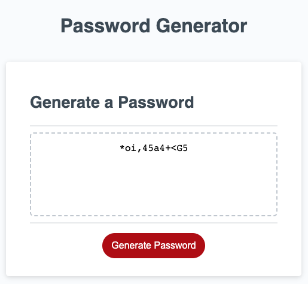
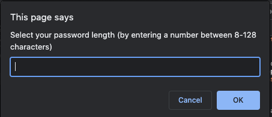
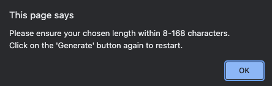

# Password Generator Starter Code

## Description

This browser-based password generator will allow you to generate a strong password (at least 8 characters in length and at least two types of characters) for your convinience.

Following options are available with this generator:
- length of the password (8-128 characters)
- character types (case, numeric, special characters)

This project was also for my personal learning to consolidate my knowledge on basic JavaScript concepts, incorporating with HTML and CSS. It was especially useful in testing my skills on correctly defining and executing functions.

## Usage

The screenshot above demonstrates the generator in use.

How to use:
Click on the 'generate' button to initiate the password generation process.

Please enter the required information as requested by the prompt in the entry field.
1) Enter the length of password desired between 8 to 128 characters (in numbers)
2) Click 'ok' for at least one character type when prompted. There are four different types (lower case, upper case, numbers, special characters)
3) The final password will be displayed for your use.

Troubleshooting:

If characters other than requested is entered in the prompt (or left empty), or if no characters are selected in the follow-up prompts, the generator will return an error.

Please click on the 'generate' button to try again.

## Credits

Codes provided in the University of Adelaide Full-Stack Development bootcamp (course ID: UADEL-VIRT-FSF-PT-03-2023-U-LOLC-MTTH) was used as initial references & starting point in building the initial codes.

Additional code & general references include the following:
- 'Build a Password Generator With JavaScript - Tutorial' by Web Dev Simplified: <https://www.youtube.com/watch?v=iKo9pDKKHnc>;
- 'Random Password Generator using Javascript' by Foolish Developer: <https://dev.to/code_mystery/random-password-generator-using-javascript-6a>
- 'Var, Let, and Const – What's the Difference?' by freeCodeCamp: <https://www.freecodecamp.org/news/var-let-and-const-whats-the-difference/>
- 'Window confirm()' by W3 Schools: <https://www.w3schools.com/jsref/met_win_confirm.asp>

## License

If not indicated, all codes are subject to MIT License.
